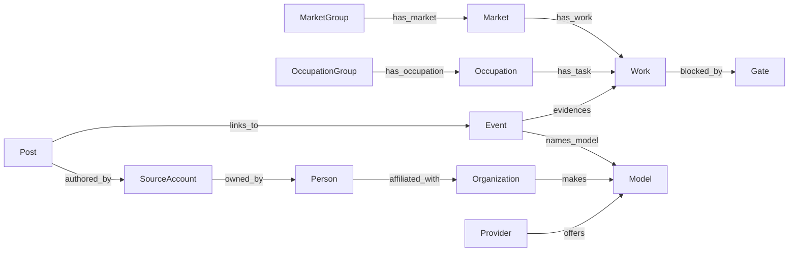

# openaiwill 本体

openaiwill 只有这一个本体。它分两部分：

- **schema**：[schema/schema.json](schema/schema.json)，唯一的类型定义——类、属性、关系、受控词表、约束。SQL 的枚举约束、数据文件格式、抽取与判定的提示词、站点标签都由它生成或与它逐项核对。
- **数据**：符合这份 schema 的实例。世界目录（赛道、工作、职业）、闸门、公司名单随版本封存；人物、账号、帖子、更新、模型、供应商每天在变，存在 PostgreSQL。

当前版本为 **v2.0.0 本地草案**。版本号表示类型定义的结构，不表示内容已经穷尽或已生产发布。

## 先看什么

1. [schema/schema.json](schema/schema.json)：正在使用的类型定义，可编辑的源文件。
2. [releases/v2.0.0/ontology.ttl](releases/v2.0.0/ontology.ttl)：同一份 schema 的标准格式导出（RDFS/OWL、SKOS、SHACL）。
3. [releases/v2.0.0/data-format.json](releases/v2.0.0/data-format.json)：封存数据文件每一行的格式，由 schema 生成。
4. [赛道与工作目录](releases/v2.0.0/market-catalog.md)、[职业与全部任务目录](releases/v2.0.0/occupation-catalog.md)。
5. [设计札记](../../docs/data/ontology-journal.md)：为什么这样定义。schema 里只有定义，没有札记。

## 目录

| 位置 | 内容 |
|---|---|
| `schema/schema.json` | 类型定义的源文件；`schema/CHANGELOG.md` 记录每个版本改了什么 |
| `data/gates.json`、`data/organizations.json` | 闸门与公司名单的源文件，随版本封存 |
| `data/model-catalog-map.json` | 外部模型目录的归属方、供应商对照，不封存 |
| `releases/v2.0.0/` | 当前封存版本 |
| `releases/v1.0.0/` | 上一版。它早于 schema，自带 `model.json` 和旧的数据格式文件，按当时的合同原样保留 |

`datasets/platform/` 是 1.0.0 的前身，作为历史保留，不是本体。

## 类



图里只画了主要关系；全部关系、定义域、值域和基数在 schema 的 `relations` 里。五个概念类共用抽象类 `Concept` 的属性。采集运行、判定运行、检查点等过程记录不是本体的类，schema 的 `process_records` 列出了它们。

权重和进度值不属于本体。定义没有可靠来源时保留 `null`；职业中文为 AI 翻译，任务中文仍未补齐。

## 改 schema

1. 编辑 `schema/schema.json`。
2. `pnpm ontology:projections` 重新生成 SQL 约束文本和站点标签。
3. `pnpm ontology:test`、`pnpm ontology:check`、`pnpm data:test`。

`ontology:check` 做三件事：逐个验证封存版本的完整性和 ID 继承；验证 schema 自身（类、属性、关系、词表的引用都存在）；逐列比对 `db/migrations` 里实际生效的约束值表和词表是否完全相同。数据库测试另外核对每个属性声明的列存在、可空性一致。

## 封存新版本

```sh
pnpm ontology:seal
```

它用 schema 里的版本号封存一个新版本，逐字节继承上一版的全部数据文件（所以所有 ID 不变），拒绝覆盖已有版本。[版本和 ID 规则](VERSIONING.md)规定什么变化升哪一位。

`pnpm ontology:build` 是 1.0.0 的构建器，从 platform/v0.0.1 提取；保留它是为了能复现 1.0.0。

## 代码入口

| 文件 | 作用 |
|---|---|
| `scripts/lib/ontology-schema.mjs`、`scripts/data_pipeline/ontology_schema.py` | 读取和验证 schema（Node、Python 各一半） |
| `scripts/build-ontology-projections.mjs` | 由 schema 生成 SQL 约束文本和站点标签 |
| `scripts/lib/ontology-export.mjs` | 由 schema 生成数据文件格式和标准格式导出 |
| `scripts/lib/ontology-package.mjs`、`scripts/seal-ontology.mjs` | 封存与验证 2.0.0 及之后的版本 |
| `scripts/lib/ontology-release.mjs`、`ontology-data.mjs`、`ontology-data-format.mjs` | 1.0.0 的冻结合同，只用于验证和复现 1.0.0 |

完整边界见[模型与存储说明](../../docs/data/model-and-storage-boundary.md)，数据库与流程见[本地数据链路](../../docs/development/local-data-pipeline.md)。
