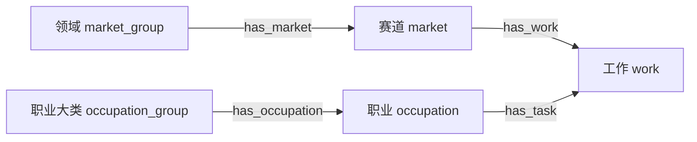

# openaiwill 本体

这里独立维护**工作、赛道、职业的定义、分类和关联**。本体使用 JSON Schema + JSONL，供后续数据库导入使用。

当前本体合同为 **v1.0.0 本地草案**，从已封存的 platform/v0.0.1 提取完整目录并保留既有 ID。版本号表示拆分后的新合同，不表示内容已经穷尽或网站已经接入。原混合包仍保留在 `datasets/platform/`。

## 先看什么

1. [model.json](releases/v1.0.0/model.json)：五种概念类型、四种关系类型及允许关联的端点。
2. [schema.json](releases/v1.0.0/schema.json)：字段类型和格式约束，标准 JSON Schema 2020-12。
3. [赛道与工作目录](releases/v1.0.0/market-catalog.md)、[职业与全部任务目录](releases/v1.0.0/occupation-catalog.md)：可读的全量目录。
4. [覆盖与定义缺口](releases/v1.0.0/coverage-report.json)：来源范围、数量和未定义部分。

## 类型与关系

下图描述类型允许的关联。同名工作不会因此自动合并成同一个条目。



- `concepts.jsonl`：每个具体条目的 ID、类型、名称和可用定义。
- `relations.jsonl`：条目之间有类型的关系，以及所属视图与显示顺序。
- `external_mappings.jsonl`：条目与外部分类代码的关联，保留来源版本和候选状态。
- `reference_*.jsonl`：外部职业、任务、活动、分类代码及其关联。
- `sources.jsonl`、`coverage.jsonl`：来源、许可和对照覆盖。

权重、事件、指标及进度值继续属于后续运行模型。本包也不保留 O*NET 重要性、相关性、频率或样本数等统计值。定义没有可靠来源时保留 `null`；职业中文为 AI 翻译，任务中文仍未补齐。

## 可执行检查

```sh
pnpm ontology:test
pnpm ontology:check
```

检查包括严格 Schema、概念身份、关系端点类型/视图、悬空引用、重复边、分类环、外部来源代码与候选映射状态，以及封存文件完整性。JSON Schema 负责字段约束，跨记录的关系规则由校验器执行；单独通过字段校验不代表引用有效。

生成器从经过校验的旧版本只读提取，默认路径已有版本时拒绝覆盖：

```sh
pnpm ontology:build
```

若要复查构建，在本地忽略目录中使用一个新的候选路径：

```sh
pnpm ontology:build --out=data/ontology-review/rebuild-1
```

这是重建候选，构建时间与清单根哈希可能变化；不是用同版本覆盖原件的发布操作。[版本和 ID 规则](VERSIONING.md)规定正式修订的行为。

生成模型和 Schema 的维护入口是 `scripts/lib/ontology-schema.mjs`；投影与关系校验在 `scripts/lib/ontology-data.mjs`，封装和完整性校验在 `scripts/lib/ontology-release.mjs`。版本包里的文件是生成结果，不能直接编辑。

本体包已与业务运行模型划清范围；完整边界见[模型与存储说明](../../docs/data/model-and-storage-boundary.md)。数据库表和 Compose 已通过[本地数据链路](../../docs/development/local-data-pipeline.md)实施，本体包原件保持不变。
