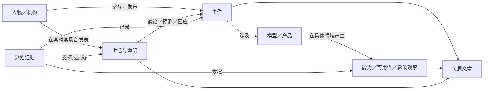

# AI 进程知识库：从事件、讲话到每周公众号

设计日期：2026-09-12。状态：第一版数据方案，尚未创建数据库、接通增量采集或配置定时任务。

**最新运行方式：本地采集与处理，上传标准化批次，Next.js 全栈展示。** 本地先运行一段时间，首阶段无需线上爬虫或独立 API 后端。实现和发布范围以[本地采集与网站发布](../development/local-collection-and-publishing.md)为准；下文 SQLite 建议仅针对本地存储，线上数据存储尚未选定。

产品核心是估计和解释“AI 接管世界的进度”：100 分代表 AI 具备独立完成主要生产与服务工作的能力。先固定世界范围与权重，由 AI 给出三情景状态估计，再用新事件、企业采用和社区信号修订。知识图谱连接人物、产品、时间、场合、采用方与原始证据；来源身份、声明核验、实际观测和 AI 估计分别记录。

**2026-09-12 范围修订：采用 AI 初始估计和事件驱动模拟，不回溯历史。** 总分与企业采用机制以[模拟模型 v0.3](takeover-simulation-v0.3.md)为准；[v0.2](takeover-progress-framework-v1.md)保留为原始事件与社区观测层。人工交付等级不是日常前置条件。

## 1. 第一步做什么

先建立世界范围与权重草案、AI 三情景状态和事件更新规则，初始值允许明确标注的 AI 先验估计。同时保留已核验的可采字段，建立原始快照、事件关联、企业采用关系和赛道映射。社交热度归一化需要其自己的样本，不能与世界权重混为一谈。

真正启用采集时只跟踪之后的新材料，缺失字段保持未知，第一次取得计数不能反推出过去的增速。历史回补留作以后有审核的社区贡献；今天取得的互动计数不能冒充事件发生当周的计数。

## 2. 要保存的内容

| 内容 | 保存什么 | 读者能问什么 |
| --- | --- | --- |
| 人物、机构与产品 | 标准名、别名、类型；人物当时的身份；模型家族与具体版本；公司归属 | 谁参与了？是哪一版模型？ |
| 事件 | 一件事的发生或计划发生、时间精度、状态、场合、参与者、前后关联 | 上周到底发生了哪些变化？ |
| 讲话与声明 | 谁说、代表谁、原文短摘与中文转述、时间、场合、谈论对象、原始出处 | “AGI 到来”是谁的判断，原话是什么？ |
| 原始证据 | X 帖子、官方发布、文档、视频或逐字稿；作者身份、发布时间、定位信息与采集版本 | 这句话和这个事件能追到哪里？ |
| 社交观察 | 相关帖子、互动计数快照、发声账号、社区分布、查询范围和提供方 | 事件受到了多少可观察关注，来自哪里？ |
| 企业采用 | 哪家公司确认引入哪项能力、采用阶段、所属集团与原始声明 | 能力是否正在进入具体产品或工作流程？ |
| AI 模拟状态 | 世界范围、固定权重、三情景完成度、材料与假设、模型版本 | 距离 100 分的终点估计还有多远？ |
| 可用性与影响观察 | 谁能用、通过什么渠道、在哪些地区；能力、应用、工作流程变化及证据 | 发布以后，现实中改变了什么？ |
| 关系 | 人物任职、公司开发模型、版本继承、事件涉及产品、声明回应事件 | 不同事件、人物和产品怎样连起来？ |
| 周报期次 | 报告区间、截稿时间、入选事件及版本、编辑判断、下周日程、修订记录 | 当时我们知道什么，后来有何变化？ |

所有类别共用稳定的内部标识；面向读者展示名称、日期和原始链接，不展示技术编号表。

这些箭头表示有类型、有出处的关系。一般性的“相关”不能自动升级为因果；例如两款产品先后发布，不足以认定后者是对前者的回应。

## 3. 一条事件的具体结构

**事件主体**：中文标题、简短事实摘要、事件类型、相关机构／人物／产品版本、事件状态、关联领域、原始证据、审核与修订记录。

事件类型先保持少量：产品或模型发布、可用范围变化、研究或测评结果、公开讲话、实际部署、重大限制／失败／延期／撤回。只有与能力、获取方式或实际使用相关的融资、合作等商业事件才进入进程主线，并保留入选理由。

**时间**分开存：

- 发生时间：事情实际发生，允许精确到日、月或区间。
- 来源发布时间：文章、帖子或视频何时发布；晚发报道不改变发生时间。
- 采集时间：我们何时取得这一版材料；补录历史事件也保留这个时间。
- 计划时间：官方公布的未来日期或窗口；原始时区、原始文字和每次改期都保留。

数据库的确定时刻统一存 UTC，同时保留来源时区和精度。只有日期的记录不能补造为北京时间零点。发生时间不明时，保留未知；可以在“本周新发现”中按来源发布时间介绍，并说明未确认发生日。

**地点和场合**分开存：线上发布、X 发帖、某场会议、现场采访、公司发布会，以及可核实的物理地点。线上发布允许没有物理地点；公司的总部地址不能替代发生地点。录像里的讲话用时间戳定位，文档用页码或章节定位。

**来源与审核**：区分“来源身份核实”“此人确实这样说过”“声明内容得到何种验证”。不能用一个 `verified: true` 同时代表三者。采集候选、可入库、已更正、撤回是记录状态；自报、独立测量、存在争议是证据性质。

## 4. 重要人物的讲话怎么收

讲话本身是一类事件；讲话中的具体论断再拆成声明。一段访谈可能同时包含对现状的判断、对未来的预测和对某项产品的承诺，必须分别归因。

每条声明至少保留：说话人或署名机构、当时职务、是否明确代表机构、原文短摘／准确转述、发言日期、场合、谈论对象、声明类型、条件与期限、出处定位、支持或反驳材料。没有署名人的官方文章归给机构，不自动归给 CEO。

“我们已经实现 AGI”保存为具名判断，同时记录说话人使用的 AGI 定义或原文上下文；没有定义就记为未说明。某人预测“明年取代程序员”时，保存预测期限与对象，之后可增加兑现、部分兑现、未兑现或仍无法判断的观察及依据，不能把预测直接转换成已公布日程。

来源扩展建议：

1. 继续以已经核实的公司／产品 X 账号作为官方更新入口，保留多账号证据。
2. 建立单独的“人物来源名单”，先覆盖所跟踪公司的核心负责人、研究负责人及确实影响叙事的研究者；人物账号不能混入官方公司账号表。
3. 用官方会议视频、逐字稿、公司网站和原始访谈补足讲话上下文。个人账号身份与发言时职务分别核验；转发和媒体转述先当发现线索。

没有公开原始材料的媒体引语可以保存在待核区，并标明媒体记者的报道性质，不冒充已采集的一手讲话。已创建[首轮人物候选表](../research/people-source-readiness-2026-09-12.md)：7 位人物、5 个候选 handle，数字身份仍待核验，全部未启用。

## 5. 怎样展示“进程”

为每个模型或领域按时间记录四种观察，并附具体证据：

| 观察方向 | 典型问题 | 证据边界 |
| --- | --- | --- |
| 能力 | 在什么任务、条件、测评版本上表现怎样？ | 厂商自报、独立测试、可重复验证分别标注 |
| 开放范围 | 只是展示、受限测试，还是已经开放使用？ | 按渠道、地区、套餐和时间分别保存 |
| 实际应用 | 谁在真实工作中使用，达到什么规模？ | 演示、客户案例、规模化使用分开；注明厂商或客户自报 |
| 工作与市场变化 | 人的工作流程、成本、产出或分工如何变化？ | 保存口径、样本、比较期间及限制；相关性不等于因果 |

领域沿用易懂的商业分类，如编程、设计、视频、客服、教育等，允许事件跨多个领域，发现新材料后再调整。现有 20 个赛道可作为初始参考，不能作为“世界被 AI 接管了多少”的分母。

没有足够依据时展示未知。回退、访问限制、测评被修正和产品撤回也进入时间线。“里程碑”是编辑选择，需要写为什么重要、影响哪个方向、有什么证据、还存在什么边界。

上述材料与企业采用记录进入[AI 模拟模型](takeover-simulation-v0.3.md)，帮助估计各赛道的独立完成能力。固定权重点合计 100，总分由权重乘以估计完成度求和。原始声量、互动和社区分布单列显示；尚未生成生产基线，不将 AI 估计或信号强度解释为已测得的全球替代比例。

## 6. 已有发布资料的建模参考

核对到的名称是 **GPT-6 Astra** 和 **Claude Fable 5.1**。官方资料可支持二者分别在 2026-09-03 与 2026-09-01 发布；两件事适合列为首批里程碑候选，但“AGI 已到来”要作为另外的声明核验。[OpenAI 发布](https://openai.com/index/gpt-6-astra/)、[Anthropic 产品与发布记录](https://www.anthropic.com/claude/fable)

以 GPT-6 Astra 为例，记录方式是：

- 事件：2026-09-03 发布；机构为 OpenAI，产品为具体模型版本，线上发布，物理地点未确认。
- 来源：官方发布材料；再补采对应官方 X 原帖，并核对作者 ID。网站已核不等于 X 采集链已经完成。
- 可用性：依据官方材料拆分开放渠道与范围，不能把“发布”自动写成所有用户均已可用。
- AGI 声明：在找到具名讲话原文之前保留待核线索，不设置“AGI 达成”事实字段。
- 编辑选择：解释它为什么可能改变能力进程，并把官方性能说法与后续独立验证分开。

Fable 5.1 同理；与 Mythos 5.1 的关系、各自的获取条件也需要独立记录，不能仅因在同一篇发布中出现而合并为一个无差别产品。这部分保留为此前已做的资料核验和建模参考，不构成当前阶段的历史采集任务，也未作为标准化事件导入生产数据。详见[里程碑来源核验](../research/gpt6-fable51-agi-milestones.md)。

## 7. 每天积累，按周成稿

建议的增量流程：采集原始材料 → 身份和时间核验 → 事件去重与赛道映射 → 提取企业采用及社区反应 → 保存观测快照与覆盖 → AI 更新受影响赛道的三情景状态 → 计算加权差额 → 更新账本与图谱 → 形成周报。能力宣称的核验、原始计数与 AI 估计独立保存。失败的采集、未完成分页与待核材料也要留账。

同一发布被多个官方账号转发，归入同一事件并保留全部来源。之后真正扩大开放范围，应新增可用性变化事件并关联原发布；产品更名、版本升级和地区差异不能只靠标题相似度合并。

周报采用北京时间（UTC+8）周一至周日；周一成稿时回顾刚结束的一周，并预告新的一周。区间采用“含开始、不含结束”。例如 2026-09-07 成稿，对应回顾 `[2026-08-31 00:00, 2026-09-07 00:00)`，预告 `[2026-09-07 00:00, 2026-09-14 00:00)`。发布时间可调整，每期必须明确具体日期，避免“上周／下周”漂移。

每篇文章固定回答：

1. 这一周进度估计怎样变：中央估计、情景区间、各赛道更新、新增采用信号，以及模型与范围版本；原始声量／互动另列。
2. 关键事件：精选约 3–5 件，用“变化、意义、适用边界、出处”组织，数量随材料调整。
3. 人物原声：最值得记住的具名声明，附日期、场合、出处和必要上下文。
4. 哪些领域推进或受阻：展示能力、开放、应用、工作变化，而非新闻数量。
5. 接下来一周：只放有官方时间依据的日程；模糊预测单列为观察问题。没有确认日程就明确写没有。
6. 更正与追踪：上期承诺是否兑现、此前判断是否需要改写、哪些来源未覆盖。

具体文章模板见[每周公众号模板](weekly-wechat-template.md)。

每期保存入选记录的具体版本、来源快照、截稿时间、编辑理由和公开稿件版本。之后新取得的历史材料进入“补录／更正”，避免把采集时间当成新事件时间。未发布草稿可修改；已发布版本保留，另附更正。

## 8. 第一版数据库怎样落地

**建议本地 SQLite＋原始材料归档**。这是针对当前个人整理、单个写入流程、按周输出的工程选择：关系表足以生成实体图与时间线，也方便直接查询周报。SQLite 官方说明其适合本地应用与数据分析，并指出同一时刻只有一个写入者；如果后续变成多机采集、多人同时编辑或需要多服务共享写入，再评估 PostgreSQL。[SQLite 官方适用场景](https://www.sqlite.org/whentouse.html)

建议的逻辑结构如下；这是待实施的结构，不是已经建好的表：

- 主记录：世界范围与权重、AI 状态估计、模拟快照、企业采用、原始计数快照、查询范围、事件信号画像、更新账本、实体、事件、声明、来源版本、周报期次。
- 关联记录：实体关系、事件参与者、声明谈论对象、各类记录的证据关联、周报条目。
- 追踪记录：来源名单、采集与字段覆盖、计数新鲜度、记录修订、未来社区补录提案。

实体关系保存方向、关系类型、有效时间、原始证据及“来源明确说／编辑推断”的区别。人物曾任职的公司不因当前职务变化被覆盖。模型家族、模型版本、承载模型的产品分别保存，别名表处理官方中英文名及历史更名。

来源版本保存规范 URL、平台原始 ID、作者身份、发布时间、取得时间、必要短摘、可获得的原始材料路径与内容校验值；更新同一网页时追加版本。证据关联定位到具体记录和来源版本，并标注支持、反驳或仅提供背景。各类关联使用明确的外键，不能留下无法追到对象的悬空关系。

采集覆盖按“来源＋查询区间＋采集轮次”记录，包含分页是否取尽、结果数、错误和重试情况。周报期次保存时间区间、截稿时刻、条目顺序、选择理由、所用记录修订版本与来源版本，保证以后能还原当时的稿件。

持久化目录边界：公开结构与脱敏样例放在 `datasets/`；数据库、完整采集响应及运行日志放在已忽略的项目本地 `data/`。公开文档可入库版本管理，凭据、完整社交平台归档和私人材料继续排除。实际建库时再添加 SQL 迁移、导入与校验命令。

## 9. 验收与实施顺序

1. 定义 100 分终点对应的世界范围与权重，允许 AI 生成带理由与假设的三情景基线；不采集历史。
2. 标准化器保留互动字段，增加企业采用关系及来源角色，建立观测快照与新鲜度记录。
3. 从实际启用日起取得新事件、采用确认与社区反应，按固定模型更新受影响赛道；人物来源名单单独核验。
4. 实现可复算的模拟快照和更新账本，从同一份状态生成进度估计、周报及解释图谱。
5. 日常流程跑稳后再确定调度；历史时间线补录可另行发起有审核的社区贡献。

第一版通过的标准：每条公开事实可追到来源版本；声明能追到作者与场合；人物身份、事件时间和开放范围不会混淆；同一事件多账号发布不会重复计数；官方延期会更新预告；历史补录不伪装成本周新事件；周报可还原；采集失败不会被显示为“没有更新”。

现有基础截至 2026-09-11 为 13 家公司的 51 个启用 X 账号，另有 8 个待处理记录。它是来源名单，尚不代表历史事件完整、连续监测已开通或人物讲话已覆盖。百度／文心继续排除在已确定的公司范围之外。参见[账号目录](official-x-accounts.md)和[覆盖缺口](../../datasets/official-x-account-gaps.json)。
