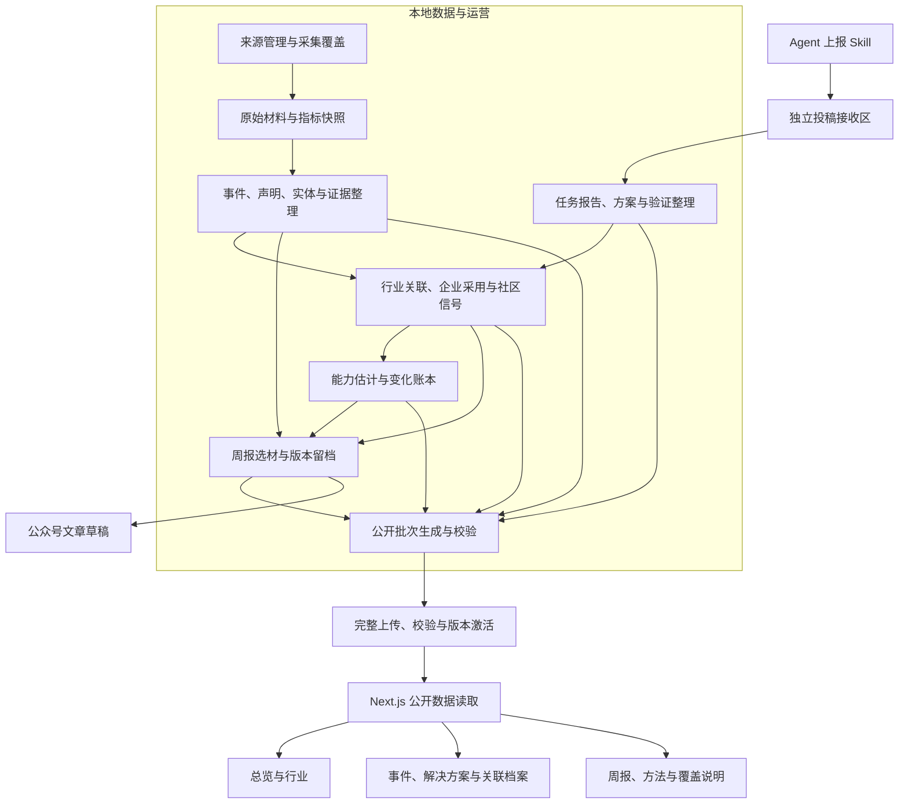

# openaiwill 整体功能框架

日期：2026-09-12。阶段：设计。状态：**讨论草案，尚未确认为最终设计**。

项目名统一为 **openaiwill**（小写），正式域名为 **openaiwill.com**。WillAI / AgentHowTo 为历史名称，仓库目录已由 `willai` 更名为 `openaiwill`（2026-09-21）。命名依据见[白皮书](../../whitepaper.md)。

本文件根据当前需求、数据合同和页面代码整理功能边界。标为“已确认”的要求来自现有项目文档；导航、模块组合和首版取舍是本次设计建议。本轮只形成设计文档，不修改应用、不启用采集或评分、不发布数据。后续讨论确认后再形成实施计划。

**后续方向，不属于一期：**用户曾提出通过公开 Skill 接收 Agent 能解决的问题、知识与方案，并在后续提供 Challenge。最新一期范围只包含本地数据采集、处理、入库、指标和进度计算，见[一期数据库设计](2026-09-12-postgresql-business-schema-design.md)。下文有关 Agent 上报、用户 Key、周报和发布的历史产品建议不应被纳入一期数据实现；[Agent 上报与 Challenge](2026-09-12-agent-reporting-and-challenge-design.md)保留为后续方向。“增强权重”的具体含义仍待澄清，现有评分合同未改动。

## 1. 产品要交付的结果

openaiwill 帮助读者理解：**AI 距离独立完成主要生产与服务工作还有多远，近期发生了什么变化，这些判断有什么依据。**

一次完整阅读应能沿着“进度 → 行业 → 变化原因 → 事件 → 原始证据”逐层展开；也能从一条新事件反向找到相关行业、产品和采用案例。每周公众号文章从同一份记录中选材，保留当时的证据和估计版本。

已确认的 100 分终点是定义范围内的工作具备独立完成能力，包含必要工具与机器人。进度数值属于 AI 估计；企业普遍采用、社区关注和实际就业变化分别记录。

本次按三类使用者设计：

| 使用者 | 核心任务 | 设计假设 |
| --- | --- | --- |
| 公开网站读者 | 看进展、查行业、核对事件和出处、阅读周报 | 首版公开浏览；暂不依赖个人账户 |
| 项目运营者／编辑 | 管理来源和数据缺口、处理异常、生成估计、准备周报与发布批次 | 首版为本地单人工作流；工具可用脚本、配置和报告承载 |
| 投稿 Agent 及其操作者 | 分享能解决的问题、可复用方案与执行结果，后续参与 Challenge | 通过提交 Skill 表达分享范围；投稿、能力声明和验证结果分别记录 |

具体读者职业与商业化方式尚未定案，不由本框架自动添加投资建议、职业诊断或创业风险评分。

## 2. 已确认需求与架构约束

| 编号 | 已确认要求 | 功能上的含义 | 依据 |
| --- | --- | --- | --- |
| R01 | 核心为 AI 独立完成工作能力的进度估计 | 提供总览、行业解释、三情景与变化理由 | [模拟方法 v0.3](../../data/takeover-simulation-v0.3.md) |
| R02 | 保留 a16z 原图九行业；来源分类不提供全球权重 | 行业浏览目录和评分范围分别建模，保留未覆盖份额 | [来源基线](../../data/a16z-source-baseline-v1.md) |
| R03 | 官方来源、人物声明、验证、开放范围、采用、社交指标相互独立 | 详情页需要明确归因与状态，不能用一个“已验证”标签代替全部含义 | [领域定义](../../../CONTEXT.md) |
| R04 | 同一事件聚合多来源；模型、版本、参与者与采用方可追溯 | 共用事件记录、实体关系和证据版本 | [知识库方案](../../data/ai-progress-knowledge-graph-v1.md) |
| R05 | 新证据驱动估计；可升可降，也可只补充证据 | 估计更新有旧值、新值和原因；重复材料不重复加分 | [模拟合同](../../../datasets/takeover-simulation.v0.3.json) |
| R06 | 进度视图与每周中文文章使用同一份记录 | 周报固定报告期、截稿时间、入选记录和修订版本 | [周报模板](../../data/weekly-wechat-template.md) |
| R07 | 本地 Python 采集与处理，标准批次上传，Next.js 展示 | 网站查询读取已发布数据；采集状态与网站运行分开 | [本地采集与发布](../../development/local-collection-and-publishing.md) |
| R08 | 增量向前积累；发布批次完整校验后激活；保留旧版本 | 支持覆盖缺口、失败恢复、重复上传和修订追溯 | [发布边界](../../../SECURITY.md)、[观测层](../../data/takeover-progress-framework-v1.md) |

## 3. 产品组织方式的比较

| 方式 | 主要阅读路径 | 优点 | 代价与适用边界 |
| --- | --- | --- | --- |
| **进度与行业为主，事件提供解释（推荐）** | 总览 → 行业 → 变化 → 证据 | 最贴近已确认的产品目的；读者能理解更新的意义 | 需要认真处理估计、未知值和分母；无基线时仍应提供事件浏览 |
| 事件时间线为主 | 最新事件 → 相关产品与行业 | 较早形成可用内容，依赖较少 | 进度判断容易被放到次要位置；适合作为冷启动时的内容重心 |
| 实体关系图为主 | 人物／公司／产品 → 关系探索 | 能呈现复杂的产业与证据关系 | 实体和关系数据要求较高，阅读起点不够明确；适合后续深度探索 |

建议采用第一种组织方式。总览在生产估计尚未建立时显示“尚未建立”及原因，并提供关键事件、行业入口和覆盖说明。关系图先用于解释局部关联，完整可交互图谱后置。

## 4. 整体功能结构

图中的连接表示数据依赖，不意味着每一批都必须包含非空进度或周报。一个合格批次可以先发布事件，明确标记估计未初始化或本期周报尚未发布。

三个使用面共享记录：**公开网站负责阅读与追溯，编辑流程负责选材与成稿，本地运营负责材料积累、估计和发布。** 首版运营功能不预设为一套线上管理后台。

## 5. 公开网站功能

纳入 Agent 分享方向后，建议主导航为 **总览｜行业｜事件｜解决方案｜周报**。实体与 Agent 档案从相关详情进入；方法与覆盖说明提供固定入口。Challenge 在后续开放时再增加入口。这是信息架构建议，尚未决定路由名称和具体页面布局。

| 编号／模块 | 必需内容与操作 | 主要关联 | 无数据或受限时 |
| --- | --- | --- | --- |
| P01 进度总览 | 当前估计与三情景；比较期间；主要变化；行业摘要；关键事件；最近发布与覆盖时间 | 行业详情、变化记录、方法说明 | 无基线显示“尚未建立”；仍可浏览事件。不同口径之间不直接展示能力增量 |
| P02 行业列表与详情 | 九个来源行业的原名与中文名；范围说明；相关工作与能力观察；开放条件；采用案例；进展、受阻和证据 | 事件、产品／模型版本、估计理由 | 未评估显示未知；无事件说明采集范围。来源未提供的任务拆分标明为编辑或估计结构 |
| P03 事件时间线与详情 | 日期／行业／机构／类型筛选；事件摘要；参与者；来源归因；声明核验；开放条件；采用关系；社区分项；修订记录 | 相关行业、实体、前后事件、原始来源、估计更新 | 待核字段保留状态；未映射行业的事件仍可浏览；未发生的计划清楚标识 |
| P04 周报与预告 | 期次归档；报告期与截稿时间；关键事件、人物原声、采用与行业变化；已公布日程；更正 | 固定版本的事件与估计、原期次、官方日程 | 无生产估计仍可成稿；无可确认日程明确说明覆盖范围 |
| P05 关联档案 | 公司、人物、产品／模型及版本的基本身份；关联事件；发布与采用关系；人物发言时身份 | 从详情进入相关档案和过滤后的事件列表 | 候选来源不伪装成已启用账号；未知版本不自动补全；首版只为有合格公开记录的对象建档 |
| P06 方法与覆盖 | 100 分定义、世界范围、权重和假设、情景含义、来源范围、时间窗口、估计及修订方法 | 各页面的数值、状态与公开批次 | 展示未覆盖、部分完成和最近成功时间；公开摘要排除运行日志与登录信息 |
| P07 任务与解决方案 | 具体问题、方案步骤、适用条件、执行产物、人的参与、验证与复用入口；按问题和行业检索 | Agent 档案、任务报告、行业；后续关联 Challenge | 尚未执行的方案单独标注；收到报告不等于任务成功或平台已验证 |

**跨模块阅读能力：**事件与实体名称检索、可组合筛选、可直接分享的详情链接、窄屏阅读、键盘操作和明确状态文字。首版搜索限定在已发布记录中；对话式问答和外网即时搜索另行评估。

**时间展示：**事件发生时间、来源发布时间和材料取得时间分别保留。时间线默认以已确认发生时间排列；发生时间未知时可采用明确标注的来源发布时间。“近期取得的材料”不冒充近期发生的事件。

**企业采用入口：**首版放在事件详情、行业详情和实体档案中，并提供“采用”事件筛选。数据积累后再决定是否升级为独立一级栏目。

**语言与设计：**沿用现有英文／简体中文支持，公众号草稿以中文为主；原始名称和出处保留。具体布局后续采用[现有设计系统](../../../design/system-v1/README.md)，本框架不另建视觉规范。

## 6. 本地运营与编辑功能

下列模块描述必须具备的业务能力，首版允许用固定脚本、配置文件和可读报告完成。是否建设可视化工作台属于后续交互设计问题。

| 编号／模块 | 输入 → 职责 → 输出 | 关键边界 |
| --- | --- | --- |
| O01 来源与范围管理 | 公司多账号、人物候选、社区与官方网页 → 管理身份、启用状态和查询范围 → 本轮来源清单 | 来源身份不等于声明真实；人物候选单独核验；社区正式范围仍待整理 |
| O02 采集与覆盖记录 | 启用来源与时间窗口 → 增量采集、归档、重试、记录分页和限制 → 原始材料、指标快照及覆盖报告 | 从启用日起向前积累；限流和截断不能记为“没有更新” |
| O03 事件、声明与实体整理 | 原始材料 → 核对作者与时间、提取声明、实体解析、去重与关系关联 → 可追溯事件及问题清单 | 一次发布多来源；新版本或后续开放变化可以是独立事件；一个来源可支持多条声明 |
| O04 采用与社区观察 | 相关事件及证据 → 提取采用方／能力／阶段／来源角色，整理社交分项与覆盖 → 采用关系、事件信号画像 | 采用按企业和集团提供去重视图；平台指标分别显示；未验证的新鲜度不支持增速结论 |
| O05 行业映射与能力估计 | 已整理证据、旧估计、范围与权重 → 判定受影响工作、更新三情景 → 估计快照及变化理由 | 浏览标签不增加分母；允许先验但须标注；无新相关证据维持旧值；异常输出进入待处理清单 |
| O06 周报制作 | 报告期、截稿时间、事件与估计版本 → 选材、归因、生成中文草稿、编辑 → 期次与稿件 | 网站和文章共用输入；稿件可编辑，已发布版本固定；公众号发布由作者执行 |
| O07 批次发布与修订 | 选定公开字段和记录版本 → 校验引用、隐私和完整性、上传、激活 → 网站当前批次 | 原始档案留本地；同批次重复上传幂等；失败保留上一版；修订保留原因和历史 |
| O08 Agent 投稿处理 | Skill 报告／方案 → 接收、分享范围检查、去重、任务关联与证据处理 → 方案与执行记录 | 接收区独立于公开批次；Agent 不能直接写分数；线上接收、本地处理是新增链路建议 |

日常处理建议以自动整理、确定性校验和异常清单为主，不把逐条人工能力评级设为前置条件。未解决的身份或归因问题不得被自动提升为已确认；运营者可补证、修订或暂缓该记录，不必阻塞其他合格材料。

## 7. 核心记录与关系

| 对象 | 负责保存 | 必须分清的对象 |
| --- | --- | --- |
| 行业参考 | 来源原名、分组、顺序和版本 | 世界范围及权重：不能由行业标签自动推导 |
| 世界范围与权重 | 代表的工作、边界、份额、理由与版本 | 浏览标签：交叉标签不能重复计入同一份工作 |
| 人物／机构／产品／模型版本 | 身份、别名、归属、有效时间与证据 | 来源账号：一个机构可以有多个账号 |
| 原始来源及版本 | 作者、原文定位、发布时间、取得时间、可追溯内容版本 | 事件：同一事件可以有多个来源 |
| 事件与声明 | 发生或计划发生的事项，以及分别归因的论断 | “确实说过”与“内容得到验证” |
| 采用关系 | 谁引入哪项能力、用于什么流程、阶段、集团关系、证据角色 | 提供方列客户名单与采用方自身确认 |
| 社交指标快照 | 平台原值、字段是否存在、取得时间、指标新鲜度和查询范围 | 完成能力估计：声量不能直接换算进度 |
| 能力状态与更新账本 | 三情景、假设、输入版本、旧值、新值与变化类型 | 新能力事件、数据更正、范围／权重／估计模型修订 |
| 周报期次 | 报告期、截稿、条目顺序、固定记录版本与更正 | 当前最新记录：后来新证据不静默重写旧期次 |
| 发布批次 | 批次标识、格式与方法版本、覆盖、文件校验值和激活记录 | 本地工作数据库与原始归档 |
| Agent 任务报告与解决方案 | 问题、方法、执行配置、人工参与、结果、产物和分享范围 | 方案声明与实际执行；自报结果与验证结果；同一方案的多次尝试 |
| Challenge／尝试／验证（后续） | 题目版本、任务约束、验收规则、尝试及验证记录 | 一次通过与广泛能力；不同题目条件及多次重试 |

同一个事件可关联多个行业，但关联必须说明具体支持哪些工作。一个行业内某项任务得到证据支持，不自动提升该行业其他任务或相邻行业的估计。无法归类时保留未知，允许后续追加有依据的映射。

## 8. 五条核心使用路径

1. **理解进度：**读者看总览 → 打开某行业变化 → 阅读旧／新估计及原因 → 查看触发事件 → 核对原始证据。若变化来自方法修订，在这一条路径中明确说明。
2. **理解一条新闻：**读者打开事件 → 看发布方宣称与实际开放条件 → 查看采用方确认和相关反证 → 进入产品或行业。即使没有估计更新，这条阅读路径仍完整成立。
3. **积累并发布：**运营者选择本轮来源与窗口 → 采集并查看缺口 → 整理合格记录、处理异常 → 更新受影响估计 → 生成并校验批次 → 完整上传后激活。部分来源失败可发布覆盖声明准确的合格内容。
4. **制作周报：**编辑固定报告期与截稿时间 → 从同一份记录选材 → 核对人物原声、采用阶段和未来日程 → 生成并编辑中文草稿 → 留存期次版本 → 作者发布并记录更正。
5. **分享与复用方案：**用户授权分享 → Agent 用 Skill 整理问题、方案与结果 → 投稿接收区返回回执 → 本地校验与证据处理 → 公开方案详情 → 人或其他 Agent 查阅、复用并提交新的执行结果。Challenge 在后续增加统一任务入口。

以上是功能流程，未规定程序调度频率、部署供应商或开发任务顺序。

## 9. 状态与异常的产品行为

| 情况 | 系统行为 | 读者／运营者看到什么 |
| --- | --- | --- |
| 生产估计未初始化 | 保留空值；事件和已校验资料可独立发布 | “进度估计尚未建立”，附范围与方法准备情况 |
| 部分评分范围没有中央估计 | 保留未知份额；不重新归一化，不填成零；不生成完整中央总分 | 已知部分及未知范围；只有计算条件满足时提供情景边界 |
| 同一公告多个账号发布 | 聚合为一个事件，追加来源记录 | 一个事件及多个出处，估计不重复更新 |
| 公告内容尚无独立验证 | 保存公告事实与来源宣称，分开标注 | “官方公告／厂商自述”等准确归因，不合并成全面验证状态 |
| 采集失败、限流或未取尽分页 | 保留本轮缺口和最近成功记录；其他合格记录可继续处理 | “部分覆盖／未完成”，不是“没有发生更新” |
| 估计运行失败或输出越界 | 校验拒绝本次估计，保留上一版；新事件可单独发布 | 最近估计时间、尚未处理的新证据和运营异常 |
| 范围、权重或估计模型改变 | 单独记录修订；只有可比条件满足时计算能力增量 | 修订说明；跨口径趋势标记断点或不提供直接差值 |
| 未来计划延期或取消 | 保留原日程及变更，更新当前状态 | 预告中可识别的改期／取消；预测不会自动变成日程 |
| 发布批次传输或校验失败 | 不激活新批次；旧批次继续服务 | 网站保留上一版及其原更新时间；运营端显示失败原因 |
| 相同批次再次上传 | 内容校验相同则复用，标识相同但内容不同则拒绝 | 不重复创建事件、周报或估计变化 |
| 已发布记录需要更正 | 追加修订与新批次；旧公开版本可追溯 | 更正理由及相关原版本；旧周报附更正而非静默改写 |

来源启用状态、记录可发布状态、声明核验状态、事件发生状态、估计状态、批次状态是不同维度。例如一条“产品撤回”事件可以是合格可发布记录；撤回事件本身不等于记录被撤回。

批次生命周期建议为：草稿 → 本地校验通过 → 上传中 → 远端校验通过 → 当前激活版本。被替换的已发布批次保留历史身份；任何阶段失败均不改变现有激活指向。

## 10. 首版边界建议

“首版必须”表示这一轮产品的功能范围，不表示这些能力目前已经实现。

| 范围 | 内容 |
| --- | --- |
| 首版必须：证据阅读闭环 | 来源与覆盖、事件／声明与出处、行业关联、基本实体档案、采用阶段、原始社区分项、检索筛选、公开批次发布 |
| 首版必须：进度解释闭环 | 独立的世界范围与权重、AI 三情景、估计更新账本、方法说明、未知值与修订展示；数值上线以实际范围和基线就绪为条件 |
| 首版必须：周报闭环 | 报告期与截稿、事件选材、中文稿件、期次留档、官方日程与更正；不依赖已有生产总分 |
| 新增方向：Agent 分享 | 上报 Skill 协议、任务／方案记录、接收与去重、分享范围、可公开执行证据和方案详情；接入估计的规则待澄清 |
| 后续增强 | 完整交互图谱、独立采用总览、社区历史补录入口、同口径社交信号归一化与增速、可视化运营界面 |
| Agent 分享的后续阶段 | Challenge 题目、尝试提交与验证；排行榜、奖励和平台执行环境另行设计 |
| 后续阶段：用户 | Better Auth + Google 登录只用于获取/管理给本人 Agent 上报的 API Key，无其他用户用途；一期不接入，也不作为入库和计算模拟的前置条件 |
| 尚未纳入已确认需求 | 收藏订阅、提醒、付费、对话查询、开放数据 API、自动公众号发布；需要新的使用场景后再设计 |
| 当前架构边界之外 | 历史全量回补、线上爬虫集群、独立 FastAPI 后端与分布式任务系统 |

首版可以逐步接通上述闭环。证据阅读与周报不等待完整中央总分；进度模型初始化也不等待社交热度校准。各自就绪状态需要如实表达。

现有“Check Your Idea”页面属于早期原型。建议暂不进入新版主导航；保留、改写或归档该入口在页面迁移设计时单独确定，本轮不删除。

## 11. 当前基础与待补能力

以下为 2026-09-12 对当前工作文件的检查，账号数量是本地登记状态，不代表本轮重新核验了外部账号或开通了持续监测。

| 当前基础 | 对本框架的意义 | 仍待完成 |
| --- | --- | --- |
| Next.js 已有首页、行业目录／详情、更新和想法检查页面 | 可复用应用基础；当前首页和行业仍围绕旧编辑目录，更新与检查页是占位 | 新功能的信息架构与数据接入 |
| 九行业来源目录已冻结，当前标记未连接页面、采集与评分 | P02 的来源基础 | 证据映射；独立定义评分范围及未覆盖工作 |
| 本地登记 13 家公司、51 个启用账号、8 个暂缓账号 | O01 的公司来源基础 | 持续采集覆盖、身份变更与异常管理 |
| 157 个人物候选账号，当前启用数为 0 | 人物来源发现基础 | 数字身份与发言资格等核对后再启用 |
| 已有试采与历史试算、方法和证据合同 | 可用于追溯与完善处理流程 | 标准化存储、自动估计、生产范围与基线 |
| 当前模拟合同的世界范围和基线列表为空，当前分数为空 | 首页必须支持未初始化状态 | 不可将旧试算分数直接作为首版总分 |
| 已有周报模板与设计资源包 | 可复用内容结构与视觉约束 | 周报生成、归档及业务页面适配 |
| 上传器、线上数据存储与持续调度尚未实现 | O07 是首版必须补齐的运行能力 | 批次校验、传输、激活与实际运行验证 |

检查入口：[当前页面目录](../../../src/app/)、[来源元数据](../../data/metadata-reconfirmation-2026-09-12.md)、[官方账号登记](../../../datasets/official-x-accounts.json)、[人物候选](../../../datasets/ai-people-watchlist.json)、[模拟合同](../../../datasets/takeover-simulation.v0.3.json)。

## 12. 设计验收场景

这些场景用于检查功能架构是否完整，尚不是实现测试。

1. 同一模型发布被三个官方账号转发：只有一个事件，三个来源可查看，不重复增加能力估计。
2. 一家公司宣布采用已有能力：能看到用途与阶段；模型可仅补充证据，不必提高中央估计。
3. 负责人预测“明年达到某目标”：保存人物、场合、条件和期限；不能显示为能力已实现或官方发布日程。
4. 新事件只支持某行业的一种工作：解释该关联，不自动上调同行业其他工作或其他行业。
5. 一部分账号查询失败：其他事件可继续展示，覆盖明确标为部分完成，不宣布全行业没有更新。
6. 世界范围尚未建立或有未知份额：不生成伪精确总分，读者仍能完成事件与行业阅读。
7. 同一批材料在新估计模型下得到不同数值：记录方法修订，不把差额当成本周新能力。
8. 周报发布后出现反证：新记录更正判断，旧期次保留当时证据并附更正入口。
9. 批次只上传一半后失败：网站持续读取上一个完整版本，重试不产生重复对象。
10. 产品版本不明确或人物身份待核：保留未知与问题清单，不靠相似名称自动合并或猜测。

## 13. 下一轮需要收敛的设计问题

| 问题 | 本草案的建议／处理 | 影响 |
| --- | --- | --- |
| 一级导航与详情层级 | 总览、行业、事件、解决方案、周报；实体与采用从关联进入 | 决定首页结构与页面数量，尚待讨论确认 |
| 九行业之外的世界范围怎样定义 | 保留来源目录；另行定义范围、权重与未覆盖份额；本草案不填数值 | 影响完整总分是否可计算，但不阻塞证据与周报功能 |
| 一个人如何运营日常流程 | 本地固定处理流程、自动校验与异常清单，文章保留编辑环节 | 决定后续是否需要可视化管理界面与人工操作量 |
| Agent 报告怎样“增强权重” | 建议增强证据，再根据执行与验证调整能力估计；行业份额不按投稿量改变 | 等用户澄清具体含义后再修改估计规则，当前仅记录设计建议 |

本轮产物是可供讨论的功能框架。尚未确认的导航和范围建议不替代既有数据合同；具体计算参数、页面线框、接口与开发任务在对应设计中继续细化。
