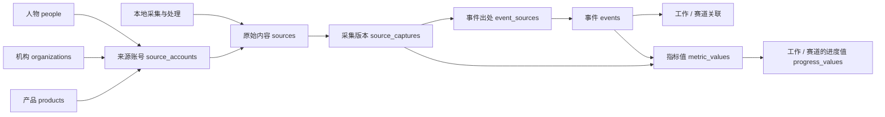

# openaiwill 第一期 PostgreSQL 业务模式设计

日期：2026-09-12。状态：**一期本地迁移、合成回归与真实档案试算已实现，未接入网页**。

第一期数据采集、清洗、归一化、事件整理和计算程序都在本地运行。当前闭环为 **本地采集 → 本地处理 → 数据入库 → 指标计算 → 进度计算 → 回查验证**。范围包含人物、机构、产品与版本、来源账号、原始内容、事件、声明、采用、标签、指标值、进度值和追溯关系。本体 v1.0.0 保持原样，数据库设计它的查询镜像。

配套 [SQL 草案](../../data/postgresql-business-schema-draft.sql)保留为设计历史；已执行的版本化迁移和使用方法见[本地链路说明](../../development/local-data-pipeline.md)。**Agent 上报、用户登录、API Key、周报和发布流程不进入一期，也不作为本次入库/计算模拟的前置条件。** 先前确认的 Better Auth + Google 选型及用户领 Key 用途保留在后续方向，不在本轮实现。

## 1. 人物、来源账号、内容与事件

| 名称 | 是什么 | 表 |
| --- | --- | --- |
| 人物档案 | 新闻和证据涉及的人，例如研究员、创始人或演讲者；可以从未注册本站 | `people` |
| 来源账号 | X、Reddit、YouTube 等平台上发表材料的账号；可能归属人物、机构或产品 | `source_accounts` |
| 原始内容 | 一条帖子、公告、文章或讲话记录 | `sources` |
| 事件 | 一次发生或已宣布将发生的事项，可以被多条内容描述 | `events` |

来源账号是被本地程序采集的外部账号，人物档案是证据中的人物；两者不需要注册或登录本系统。



图中的箭头表示关联或输入方向，不代表一对一，也不代表有了互动量就能自动得出进度。

## 2. 存储方案与文件边界

数据库保存版本化本体/定义，以及本地处理得到的业务数据和计算历史。

| 部分 | 本地内容 | PG 中如何保存 | 如何变化 |
| --- | --- | --- | --- |
| 本体 | 已封存 JSON Schema / JSONL 包 | `ontology_releases`、`ontology_concepts`、`ontology_relations` | 新版本追加，不覆盖旧版本 |
| 标签、指标定义、进度方法、权重 | 单独维护的配置包 | `config_releases` 及各定义表 | 定义变化才发配置版本 |
| 人物、来源、事件与数值 | 采集、整理、统计和估计结果 | 业务表按 `batch_id` 保存一个确定的数据版本 | 新数据或更正形成新的数据版本 |
| 原始页面、完整抓取、秘密和日志 | 本地 `data/` | 不整体导入业务数据库 | 只选择所需且允许保存的字段 |

当前草案用 `data_batches` 记录一个可独立查询、可复算的数据版本。每批包含该版本的完整对象和关系，记录使用的本体/配置版本、清单哈希和校验结果。它的作用是固定查询和计算输入，**不表示发布到哪里或对外公开**。消费者明确选择 `batch_id`，没有网站频道、当前发布指针或激活操作。

这种完整数据版本会重复保存部分人物和账号资料，换来简单、明确的历史引用。日常采集可以增量，整理时形成完整数据版本。后续如改为逐对象版本存储，需要保留相同的历史追溯能力；这属于存储优化，不引入内容发布流程。

## 3. 通用主键、版本和约束

- 所有表统一放在 `public` schema，按业务对象命名；本文省略表名前的 `public.`，SQL 中写全。无需先判断某张表属于目录、配置还是核心分组。
- 项目表名使用复数或集合名称，并保留有区分作用的业务前缀：`ontology_concepts` 表示本体概念，`source_accounts` 表示来源账号，`data_batches` 表示数据导入批次。`metric_definitions` 与 `metric_values` 分别表达定义和数值。
- 业务 ID 使用 `text`，沿用已分配 ID；不要从 ID 文本猜类型。本体、人物、账号、事件分别有稳定 ID，不设置把值记录也收入其中的 `entity` 总表。
- 人物、来源、事件、指标值和进度值等主表以 `(batch_id, id)` 为主键。关系表同样携带 `batch_id`；同一事件在两个快照中仍是同一个业务 ID，不能按历史表行数统计事件量。
- 本体以 `(ontology_version, id)` 引用；配置以 `(config_version, id)` 引用。批次固定本体和配置版本，复合外键防止混用。
- 已通过校验的目录和批次内容不可修改。更正产生新批次；只允许在接收中的批次内装载记录。不可变性由导入服务及数据库连接权限/函数共同实现，不声称单靠这些 DDL 已能阻止数据库所有者更新；这不引入登录用户的业务角色。
- 时间用 `timestamptz`。原始发布时间、事件发生时间、预定时间、采集时间、平台指标更新时间、估计时点分别保存。时区来源不明时保留未知及说明，不自行补时间。
- 每张内容/数值主表有 `record_sha256`，对允许存储的规范化字段计算。相同批次 ID 加不同清单哈希必须拒绝；同 ID、同哈希复用成功结果。关联行也纳入批次清单哈希。
- 缺失是 `NULL`，实际零值是 `0`；数值状态说明为什么缺失。金额、比例等将来新增指标必须另定单位，不能混入“计数”。
- 外键默认阻止删除被引用的证据。历史来源下架只改变新快照的可访问状态；已经被计算引用的依据不级联消失。

## 4. 一期模拟与验证顺序

先用本地已采集资料，或明确标注的模拟采集结果，验证这条链路。输入来自本地文件和处理程序，不经过用户上报接口。

| 步骤 | 本地执行的工作 | 验证结果 |
| --- | --- | --- |
| 准备数据 | 导入完整本体；选一个赛道及少量工作，准备人物、来源账号、源帖、事件、标签与覆盖记录 | 原 ID 保留，模拟材料与真实来源明确区分 |
| 处理与入库 | 清洗字段、统一时间、去重、关联对象，再写入 PostgreSQL | 主外键成立；同一来源多次取得、同一事件多篇报道可区分；重复导入幂等 |
| 指标计算 | 按定义从指定批次计算标签事件数、去重帖子数、评论数等 | 数值和手工预期一致，保存窗口、覆盖、缺失原因与输入 |
| 进度计算 | 用指定版本的实验方法读取证据及指标，生成工作进度；条件具备时按关系权重汇总赛道 | 保存输入、方法、旧值、新值与理由；未知不补零 |
| 重放与修订 | 重跑同批次，再加入重复记录、缺失值及一条更正 | 不重复计数；失败不产生可用结果；旧记录及旧计算可追溯 |

入库、指标计算和结果保存应在真实 PostgreSQL 中验证，模拟的是输入材料或试验方法。这些步骤已用五批合成材料在本地 PostgreSQL 中执行，结果见[验收记录](../../data/local-pipeline-simulation-2026-09-12.md)；另已完成 2,707 条真实来源的[本地计算试算](../../data/real-data-calculation-2026-09-12.md)。正式进度规则仍未确定，实验方法与测试数值必须明确标记，不形成正式能力基线。

## 5. 本体与规则目录

| 表 | 主要字段与约束 | 用途 |
| --- | --- | --- |
| `ontology_releases` | `version` PK、`manifest_sha256`、`schema_version`、`imported_at` | 锁定导入的完整本体包 |
| `ontology_concepts` | `(ontology_version,id)` PK、`kind`、名称、定义、`record_sha256` | 五类概念的查询镜像，保持原 ID |
| `ontology_relations` | `(ontology_version,id)` PK、关系类型、父/子概念、视图、排序 | 四类关系；外键指向同版本概念 |
| `config_releases` | `version` PK、`ontology_version`、清单哈希 | 标签/指标/方法/权重配置的一个完整版本 |
| `tags` | `(config_version,id)` PK、名称、说明 | 独立标签目录；不是概念的显示名称 |
| `metric_definitions` | 同上、`method_version`、`kind`、`unit`、`rule`、规则哈希 | 可采集计数或统计定义；`rule` 是经校验的声明式配置，不是任意 SQL |
| `progress_methods` | 同上、`method_version`、`spec`、规则哈希 | 估计方法、允许输入与缺失处理；未定公式时集合可为空 |
| `relation_weights` | 配置版本、关系 ID、`weight`、`status`、方法/理由 | 权重属于关系，独立于本体；未知允许空 |

本体来源、外部映射与参考目录继续保存在完整封存包，导入前调用现有校验器；这些参考表无需为了本轮查询重复展开。PG 中保存完整包哈希，可反查包里的来源、许可、映射和缺口。将来有外部代码检索需要时再增加同版本镜像表。

配置包版本和各方法版本含义不同：配置版本固定本次选择的整套目录；某个指标算法没变，可以在新配置中继续使用原方法版本及哈希。相同指标 ID + 方法版本不得对应不同算法内容。权重归一化按父节点和视图检查，未覆盖权重单独说明；市场与职业两视图不可相加成世界分母。

## 6. 人物、机构、产品和来源账号

以下每张主表均附带通用 `batch_id`、`id`、`record_sha256`。

| 表 | 业务字段 | 关系和去重 |
| --- | --- | --- |
| `people` | 名称、别名数组、公开简介、身份核验状态、身份出处 URL | 名字不唯一；人物合并需证据，原账号和事件仍可追溯 |
| `organizations` | 名称、别名、官网、可选集团 ID、身份出处 URL | 集团自引用；集团去重与企业去重分开；组织图不得有环 |
| `products` | 名称、别名、提供机构 ID、官网、产品类型 | 同名不同机构不自动合并；一个机构可有多个产品 |
| `product_versions` | 产品 ID、版本标识、公布/开放时间、来源 URL | 同一产品的版本标识唯一；模型版本也是产品版本，事件可精确引用它 |
| `person_affiliations` | 人物、机构、角色/职务、生效/结束时间、来源采集记录 | 同一人物可有多段或同时任职；未知起始时间保留空 |
| `source_accounts` | 平台、平台稳定账号 ID、handle、主页 URL、人物/机构/产品归属、个人/机构官方/产品官方/社区/未知角色、身份状态、启用状态、核验时间、依据 URL | 平台 + 稳定账号 ID 唯一；handle 可变。平台不提供稳定 ID 时用明确的临时规范键并标记待核，不能冒称已解析 |

账号归属在人物/机构/产品中至多选一个主要所有者；未知归属三者均空。员工账号通常属于人物，通过任职关系关联机构；不因为任职或蓝标就变成公司官方账号。平台认证标记、身份核验状态和采集启用状态分别保存。

例如一个创始人有两个 X 账号：一个人物、两个来源账号。一个机构在 X 与官网发布同一公告：各自保留来源，归并为一个事件。账号更名保留平台 ID；新批次记录新 handle，旧批次保持当时名称。人物或账号来自哪个版本的档案，可以由批次精确还原。

## 7. 来源、采集和覆盖

| 表 | 业务字段 | 关键规则 |
| --- | --- | --- |
| `sources` | 平台、平台内容 ID/规范键、原始 URL、可选来源账号、内容类型 | `(batch_id, platform, external_key)` 唯一；文章无账号仍可存在 |
| `source_captures` | 来源 ID、取得时间、原发布时间、内容版本哈希、公开摘要/短引、语言、访问状态 | 一条内容多次取得形成多个采集记录；编辑、删除和指标变化保留当时依据 |
| `collection_coverage` | 平台、可选账号、查询条件、窗口、截止时间、状态、是否取尽、取回数、公开缺口说明 | 可按账号或搜索查询记录；失败、未查询、部分覆盖与实际零条分别表示 |

`source_captures` 存可公开内容和原始内容哈希；原始正文和抓取响应留在本地。评论数等数值进入指标值表，避免在内容、事件和指标三处维护同一个数字。源帖计数属于源帖某次采集；不能把两个账号上的同一公告的评论直接称为“去重评论人数”。

时间窗口统一为左闭右开 `[start,end)`。窗口内发布时间、实际采集时间和平台指标更新时间可以不同；提供方没有给更新时间时不可用采集时间冒充。

## 8. 事件、声明和采用

| 表 | 业务字段 | 关键规则 |
| --- | --- | --- |
| `events` | 去重键、类型、标题、摘要、公告/发生/计划时间、发生状态、地点/线上场合、可用性条件 | 事件 ID 稳定；去重键版本化生成，不只用标题。预定/已发生/延期/取消/未知分开 |
| `event_sources` | 事件 ID、采集记录 ID、来源角色 | 多对多；角色如官方公告、当事方自述、独立报道、反证 |
| `event_people` | 事件、人物、参与角色 | 一次活动可有多个发言人；每个发言人的声明分别归因 |
| `event_organizations` | 事件、机构、参与角色 | 发布者、采用者、报道者等不能混为所有者 |
| `event_products` | 事件、产品、可选产品版本、关联角色 | 复合外键确保版本确实属于指定产品 |
| `claims` | 事件、原始采集记录、声明文本、说话人物或机构、核验状态、核验说明 | “确实说过”与“声明属实”分别表达；核验状态不改变互动数 |
| `claim_evidence` | 声明、采集记录、支持/反对/语境角色 | 让核验有可追溯材料，不能只有一个 verified 布尔值 |
| `adoptions` | 事件、采用机构、产品/版本、使用流程、计划/试点/集成/生产/停止阶段、来源采集记录及来源角色 | 提供方列客户与采用方确认分开；按机构和集团另做去重视图 |
| `event_concepts` | 事件、本体版本、概念、候选/接受/否决状态、理由 | 与工作/赛道建立有依据的关联；标签不自动转移进度 |
| `event_tags` | 事件、配置版本、标签、赋值方法、理由 | 支持按去重事件统计 |
| `source_tags` | 采集记录、配置版本、标签、赋值方法、理由 | 支持按来源内容统计；同一内容多次采集不能直接多算一条帖子 |

同一声明可拆出多条可单独核验的 claim；一篇长文也可关联多个事件。正式开放、延迟或撤回若本身是新发生事项可新建事件，并在可用性说明中指向原公告。仅修正标题、人物归属或标签是新批次中的记录修订，不制造新事件。

## 9. 指标定义和指标值

指标定义在 `metric_definitions`，每次取得或算出的值在 `metric_values`。

| 表 | 主要字段 | 用途 |
| --- | --- | --- |
| `metric_values` | 指标/配置版本、目标种类、可选采集/事件/概念目标、`parameters`、窗口、`observed_at`、`provider_updated_at`、`evidence_cutoff_at`、`value`、值状态、覆盖状态、输入哈希 | 一次直接观测或聚合结果；跨来源和标签的聚合不要求 `event_id` |
| `metric_inputs` | 指标值 ID、输入批次、输入采集/事件/指标值三选一 | 明确本次输入集合及其固定版本 |
| `metric_coverage` | 指标值 ID、覆盖记录 ID | 证明查询范围和可见缺口；一个指标可用多个来源的覆盖 |

建议首先定义源帖评论数、转发数、互动数，以及按标签/概念/来源范围去重后的帖子数、事件数。它们是定义示例，不预填值、不继承旧合同的任务成功率等指标。

`parameters` 保存平台/账号集合、标签集合、去重方式和窗口口径等声明式参数，必须通过对应规则的参数 Schema 校验。核心关联使用外键；参数内的标签和账号引用在导入时额外校验。参数不允许作为直接执行的任意 SQL。

数值状态只有 `observed / missing`；覆盖状态另为 `complete / partial / unknown`。部分采集到 35 条是有观测值 35、部分覆盖，而不是完整总量。没返回字段是 missing + NULL；提供方明确返回 0 是 observed + 0。计数指标需非负整数校验，不能因 PG 用 numeric 而接受小数计数。

聚合必须冻结输入：同一事件三篇报道，事件数为 1，源帖数可能为 3；同一帖子的两次采集按来源 ID 去重并按规则选定一个观测时点。真正的零输入结果需要符合完整覆盖规则，不能拿查询失败生成零。

## 10. 进度值与历史

| 表 | 主要字段 | 用途 |
| --- | --- | --- |
| `progress_values` | 概念/本体版本、视图、估计时点、方法/配置版本、保守/中央/乐观值、状态、原因、旧值引用、输入哈希、假设 | 工作或赛道的状态值，保留每次修订，不是新增本体概念 |
| `progress_inputs` | 进度值 ID、输入批次、事件/指标值/子级进度三选一 | 指向此次使用的证据及汇总的子级结果 |

状态为 `uninitialized / estimated / partial / insufficient_evidence`。未初始化或依据不足时三值均空；部分结果允许中央值空，不能补 0。存在的值都在 0–100 内，保守 ≤ 中央 ≤ 乐观；只有实际可用的值参与比较。三情景是模型情景，不宣称统计置信区间。

`change_cause` 分开记录初始化、新证据、数据更正、范围修订、权重修订、方法修订。旧值通过 `(previous_batch_id,previous_value_id)` 精确引用。相同对象、视图、范围、方法和权重口径才展示能力差值；其他情况展示修订，不能把方法调整说成当天能力增加。

本轮没有确定从信号到进度的公式，因此方法表允许为空、进度表可以为空或保留 uninitialized；不自动用点赞/评论换进度。不生成世界总分；世界范围和不重叠份额就绪后另加明确的 scope 合同。

输入可以引用本批次，也可以引用更早、已校验且不可变的批次。例如沿用昨天的估计时，保留它对昨天事件/标签版本的引用，不把关联偷偷改成今天修改后的标签。输入关系必须无环；旧批次被依赖时不能清理。

配置版本升级时，只有目标定义、实际使用的方法和权重仍完全相同，才允许沿用旧估计数值并保留旧依据。影响口径的配置已变但尚未重算时，本批次保留未初始化/依据不足状态，并通过旧值引用展示历史；不能把旧数值放在新方法名下继续称为当前估计。跨批次依赖只能引用已校验并封存的数据版本；被引用版本必须保留，才能复算当时结果。

## 11. 数据导入与追溯

`data_batches` 是导入和计算追溯记录，字段为：`id`、格式版本、本体版本、配置版本、清单哈希、记录计数、生成时间、导入状态及 `ready_at`。状态为 `loading → ready` 或 `loading → failed`，表示数据是否装载并校验完成。它没有对外发布状态、目标渠道和发布权限。

导入服务应检查以下条件：

1. 相同批次 ID、相同哈希复用原结果或续传；相同 ID、不同哈希拒绝。
2. 在 loading 批次装载完整数据，检查行数、哈希、引用、参数和业务约束。
3. 校验完成后在事务中变为 ready，之后内容不可变；失败批次不能参与正式查询和计算。
4. 独立查询选择固定的 ready 批次 ID。当前本地实现将首次装载与计算放在同一事务：仅在该事务内读取 loading 批次，成功后整体置 ready；外部查询不能得到半批结果。读取历史输入时同时保留输入批次和记录 ID；已被引用的版本不能删除。
5. 导入完成只表示数据可用，不触发周报生成、内容发布或任何外部动作。

人物事件查询示例：服务器先核对选定的 `$1` 是可访问的 ready 数据版本，再用人物 ID `$2` 查询：

```sql
SELECT e.id, e.title, e.occurred_at, ep.role
FROM event_people AS ep
JOIN events AS e ON (e.batch_id, e.id) = (ep.batch_id, ep.event_id)
WHERE ep.batch_id = $1 AND ep.person_id = $2
ORDER BY e.occurred_at DESC NULLS LAST, e.id;
```

标签事件计数示例：

```sql
SELECT count(DISTINCT event_id)
FROM event_tags
WHERE batch_id = $1 AND tag_id = $2;
```

正式指标还必须带上定义中的窗口、来源范围和覆盖记录，不能把这个无窗口 SQL 当作完整指标口径。复合外键和 NULL 约束参照 [PostgreSQL 官方文档](https://www.postgresql.org/docs/18/ddl-constraints.html)；跨行业务校验仍由导入服务承担。

## 12. 数据库约束与导入校验的分工

| 数据库 DDL 直接承担 | 导入/计算服务必须另行承担 |
| --- | --- |
| 主键、自然键唯一、外键、同批次对象关系 | 允许存储的字段清单、记录哈希、批次文件/记录计数 |
| 本体/配置版本匹配、产品版本归属 | 本体关系端点类型/视图和已封存包逐条对应 |
| 值状态与 NULL 一致、数字范围、窗口顺序 | 指标定义的整数/单位/目标种类/参数合法性 |
| 人物/机构声明者互斥、输入引用三选一 | 人物/集团/输入图无环，重复事件和源帖去重规则 |
| 账号平台键、产品版本键、标签关联唯一 | 权重按父节点归一化、未知份额及汇总条件 |
| 批次唯一键、版本外键 | 清单哈希冲突处理、批次封存和并发导入控制 |
| 旧值引用实际存在 | 旧值和新值对象/视图一致，跨口径差值禁用 |

因此 SQL 能解析或建表成功不代表导入与计算程序已经完成。后续验收至少覆盖：重复批次同哈希复用/不同哈希拒绝；装载失败的批次不可用于计算；跨批次引用冻结旧输入；同批次并发导入；未知与零；同帖多次采集；同事件多篇报道；账号改名；人物多段任职；产品版本错配；指标结果与预期一致；方法修订不会被误报成能力增长。

## 13. 后续范围

用户登录获取 Key、Agent 上报和 Challenge 均不进入一期。Better Auth + Google 的既定选择不变，用户登录仍只有领取/管理 Agent 上报 Key 这一用途；需要建设后续阶段时再单独接入，不为一期建立认证表或测试用户。

## 14. 实现和下一步边界

一期已落地为正式版本化迁移、本地 PostgreSQL、Python 导入/计算程序及合成验证。34 张业务表仍无认证或 Agent 上报依赖；额外的迁移记录表仅跟踪 DDL 版本。目录父表新增 `sealed_at`，数据库触发器保护目录与 ready 批次不可变，并阻止正常 SQL 的 TRUNCATE 绕过。数据库所有者仍可主动禁用保护，生产权限部署不在本轮。

完整本体及五批合成输入已导入，指标、三情景实验值、旧值引用和重放已验证；来源范围、覆盖状态、独立时间窗口、缺失/零值、封存、回滚和修订均有真实数据库回归。配置分别约束合成阶段回归与真实证据审阅方法；真实材料的 AI 三情景判断作为带引用的独立输入保存，不按互动或采用阶段加分。真实档案增加按平台/发布时间窗口的样本计数，并保留原查询覆盖。采用阶段通过迁移 003 增加 integrated（已接入），与接入中及明确生产使用分开。配置保存来源平台/账号集合，权重要求可精确存储。当前只有局部实验判断，没有生产进度基线或世界总分。

运行方式见[本地链路说明](../../development/local-data-pipeline.md)，测试结果见[验收记录](../../data/local-pipeline-simulation-2026-09-12.md)。下一步是实际采集材料的本地转换及正式估计规则。现有本体包及完整 ID 保持不变；原有周报和网站发布文档不作为本系统数据库功能需求。
