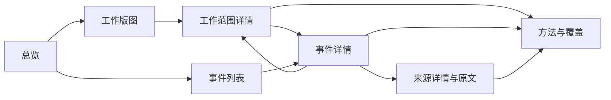

# openaiwill 第一版公开网站：页面、功能与展示设计

日期：2026-09-13（Asia/Taipei）。状态：**供讨论的完整设计建议，尚未实施到业务页面**。

已确认条件：品牌使用小写 openaiwill；沿用 Tensorlake 视觉方向及项目设计资源；**公开浏览不强制登录；始终提供完整中英双语，英文为默认语言**。本文件针对第一版网站，不改变已完成的一期本地数据系统，也不把早期整体功能草案中的周报、投稿、Challenge 或后台纳入本版。

## 1. 产品主线与推荐组织方式

首页首先提出已确认的品牌问题：**Will AI Kill Your Idea?**，并以 **Every AI update could change your answer.** 说明持续回访的理由。用户于 2026-09-13 再次提醒，页面必须体现“每次更新都重新检验你的想法”，不能在整理数据库与研究架构时丢掉这条叙事。

核心阅读路径：**我的想法属于哪个赛道、依赖哪些工作 → 通用 AI 已经能覆盖哪些部分 → 哪次更新影响了原有判断 → 证据支持到什么程度、还有什么限制**。能力估计与长期变化提供分析依据，不代替首页问题，也不等于测出了某个创业想法的失败概率。

推荐采用“工作版图为骨架、事件解释变化、原始来源支持复核”的组织方式。首页既是产品入口，也能直接开始查数据。面向关注自身工作、产品方向和 AI 能力的读者，先找到与自己想法相关的赛道和核心工作，再理解哪些产品承诺正被通用 AI 覆盖、哪些差异仍需具体证据判断。

| 组织方式 | 收益 | 取舍 |
| --- | --- | --- |
| **工作版图 + 证据链（推荐）** | 长期围绕具体工作形成可持续查询的记录；有估计和无估计都可浏览 | 需要认真处理范围、未知与证据状态 |
| 事件流优先 | 现有九个事件即可形成可读内容，冷启动较快 | 读者容易只看发布新闻，难以理解对工作的意义 |
| 全屏关系图优先 | 关系复杂时有探索价值 | 当前关系与人物数据较少；读者缺少明确起点，移动端成本高 |

推荐方案在冷启动时提高已整理事件的展示权重，导航与详情仍围绕工作，不因数据量变化反复改变产品结构。

## 2. 实际数据能支撑什么

本次通过本地 PostgreSQL 的只读事务回查，限定真实批次 `real:archive-2026-09-12:software-application-code:v1`，没有将五个合成批次计入真实内容。

| 当前事实 | 页面含义 |
| --- | --- |
| 34 张业务表；独立本体含 265 个赛道、1,016 个职业 | 足够建立双视图目录；目录数量不是已完成评估的数量 |
| 2,707 条来源、2,721 份采集记录 | 能追溯来源与采集版本；同帖多次取得不能重复计成新内容 |
| 9 个事件、12 条声明；12 条声明均为 `self_reported` | 可以展示已整理的公告与自述；不能写成九个已验证能力突破 |
| 13 个机构、18 个产品、1 条采用记录；人物为 0 | 公司与产品适合作为详情关联；人物榜、采用排行榜暂不独立开栏目 |
| 2,738 个指标值、4 个进度值 | 可以展示有口径的计数与局部试算，不是 2,738 项能力评测 |
| 4 个进度值分别对应一个赛道及三个子工作；均为初始化，无前值 | 能展示一次状态判断及组成；当前不能绘制真实能力趋势或周环比 |
| 52 条查询覆盖记录：46 条 partial、6 条 failed | 总体材料不完整；单条评论字段完整不代表整个来源范围采齐 |

当前“应用界面与业务开发”的中央试算为 44/100，情景为 22–64，三个子工作的中央值为 55、40、30。该试算未纳入已发现的两项 OpenAI 公告，属于冻结材料下的历史实验结果。**生产总分未建立，网站尚未接入数据库，ready 不等于已对外发布。**

设计及开发可用该批次验证真实长度、关系和状态，局部试算须显示“实验估计 · 已知材料缺口”。不得自动将其放进公开首页作为正式推荐分数。生产首屏在没有选定公开数据时展示产品说明与目录入口，不加载本机原始数据兜底。

依据：[正式迁移](../../../db/migrations/001_business_schema.sql)、[数据链路](../../development/local-data-pipeline.md)、[真实试算](../../data/real-data-calculation-2026-09-12.md)、[漏采核查](../../data/collection-gap-openai-2026-09-13.md)。上述数量是本次本地快照，不是持续更新的线上状态。

## 3. 四个主入口，七种页面模板

默认英文顶栏：**openaiwill · Overview · Work Map · Events · Method & Coverage · Search · EN / 中文**。

中文顶栏：**openaiwill · 总览 · 工作版图 · 事件 · 方法与覆盖 · 搜索 · EN / 中文**。

首页点击品牌即可返回。桌面直接展示导航；手机保留品牌、搜索和可展开导航。未明确选择语言时默认英文，不按浏览器语言自动进入中文。明确的链接语言优先于已保存选择；无链接语言时沿用用户选择。语言切换不依赖账号，并保留当前页面、筛选和所看对象。

导航、页面正文、数据解释、状态、空状态、错误、表单、分享说明与页面元信息均交付 `en` / `zh-CN` 两版。视觉主稿先做英文，再分别验证中文和两版移动端，不能只翻译顶栏。原始来源保留原文并标注译文；数值和证据关系保持一致。

现有本体包含 `label_en` / `label_zh_cn`，但事件 `title` / `summary`、声明和估计理由等仍是单语言字段。网站连接层还需准备与记录版本绑定的双语展示内容；切换按钮本身不代表内容已翻译完成。具体翻译存储方案在实施时确定，本次不修改封存数据或数据库。

| 页面 | 建议路由 | 核心任务 | 第一版内容 |
| --- | --- | --- | --- |
| 总览 | `/` | 理解产品，找到值得继续看的工作或事件 | 一个核心问题、一条可解释关系、工作入口、近期已整理事件、数据状态 |
| 工作版图 | `/explore?view=markets` 或 `occupations` | 找到自己关心的工作范围 | 搜索、分组树、目录表、视图切换、筛选与分页 |
| 工作范围详情 | `/explore/[conceptId]?view=…` | 看这个范围的能力与依据 | 范围定义、情景估计、子项、关联事件、采用与限制、计算理由 |
| 事件列表 | `/events` | 看什么发生了变化 | 时间序列、类型、公司/产品/工作/标签筛选、来源状态 |
| 事件详情 | `/events/[eventId]` | 分清宣布了什么、证据是什么、涉及什么工作 | 摘要、逐条声明、原始来源、关联工作、采用及可用性 |
| 来源详情 | `/sources/[sourceId]` | 核对原文、归因与采集时点 | 公开短摘录、原文链接、账号归属、各时间、互动观测、所支持的声明 |
| 方法与覆盖 | `/methodology`，章节锚点区分方法、覆盖、版本 | 理解数值和数据局限 | 终点定义、三情景、权重、缺失解释、查询覆盖摘要、方法与版本 |

`[conceptId]` 等参数使用现有稳定 ID 并正确编码，不为页面额外制造业务身份。每个事件和来源都有独立可分享的详情地址；上下文内可以侧栏预览，但直接打开地址仍是完整页面。

公司、产品在第一版通过事件详情的关联信息和事件列表筛选进入，例如公司名链接到 `/events?organization=…`。不新增独立公司/人物榜页；人物有真实记录后再复用关联展示。采用记录放进所属事件和工作详情。



## 4. 首页：品牌构图与真实内容放在同一屏

### 首屏

默认英文主标题固定为 **Will AI Kill Your Idea?**；副标题固定为 **Every AI update could change your answer.** 中文主标题建议“AI 会让你的创业想法失去价值吗？”，中文副标题沿用“每一次 AI 更新，都可能改变你的创业判断。” `What work can AI do on its own?` 可用于方法解释，不再作为首屏标题。

补充说明建议：**Find your market. See what AI already covers—and the evidence behind it.** / “找到你的赛道，查看 AI 已经覆盖的工作与背后的证据。” 主操作为 **Explore your market / 探索你的赛道**，次入口为 **See the latest updates / 查看最新更新**。搜索提示为 **Search markets, tasks, or products / 搜索赛道、工作或产品**。第一版通过已有目录和事件完成检验，不放置尚未接通的“输入想法，一键判定”表单。

桌面采用约 5/7 分栏：左侧标题与入口，右侧是一条聚焦于一个真实工作范围的关系构图。方节点、直角连线和小型状态标注继承现有规范。图只呈现当前对象及必要的 3–6 个节点，节点均能对应正文记录。

右侧关系围绕 **What changed for your idea? / 哪些变化影响你的想法？** 展开：**一条产品公告 → 已关联的核心工作 → 相关赛道与能力边界**。数据必须来自实际关系；没有经过建立的边就不绘制。选中节点后，图旁显示来源支持的变化、仍需核对的限制与证据入口，不凭一条更新判断一个行业失去机会。

品牌条带可以形成边缘构图，但不使用其高低表示分数；首屏不做无刻度的“能力地形”。全局总分在范围与正式估计具备后才启用，没有总分时用说明和可浏览内容承接，不让一个巨大的 `—` 占据画面。

### 首屏下面的连续内容

1. **当前数据说明条**：已选数据的材料截止、已整理事件数、来源数与覆盖状态。每项均有范围标签；目录数和已评估数分开。只显示真实可公开的统计。
2. **Where does your idea fit? / 你的想法属于哪个赛道？**：工作版图预览使用连续表格，默认给出有已整理证据的范围，再给出目录探索入口。每行包含工作名称、状态/中央估计、三情景范围、关联事件、估计时间。未估计的项目保留可浏览入口。
3. **Updates that could change your answer / 可能改变你判断的更新**：按记录时间语义排序的 4–6 条已整理事件。每条给出一句“宣布或观察到了什么”、涉及工作、来源类别与核验状态，并以已有工作关联理由解释它为什么值得该赛道的读者关注；条数不足就按实际数量展示。
4. **一项判断如何形成**：复用真实工作详情中的子项、权重、证据入口，压缩成一段可展开说明。当前没有正式估计时，展示“原始来源 → 声明 → 工作关联”的已经具备部分。
5. **页尾方法入口**：简短解释估计含义、当前覆盖及版本，链接白皮书和方法页。

页面结构草图（为便于本次中文讨论使用中文说明；正式视觉主稿默认英文。表示内容关系，不是最终像素稿）：

```text
openaiwill       总览   工作版图   事件   方法与覆盖        搜索  EN/中文
────────────────────────────────────────────────────────────────
Will AI Kill Your Idea?           产品更新 ─→ 核心工作 ─→ 相关赛道
Every AI update could            哪些变化影响你的想法？
change your answer.              真实范围名称 · 材料时间 · 状态
[Explore your market]            状态、限制与原始证据入口
────────────────────────────────────────────────────────────────
数据范围 / 截止时间 / 已整理事件 / 来源统计 / 覆盖情况
────────────────────────────────────────────────────────────────
你的想法属于哪个赛道？          状态与区间   相关事件    更新时点
范围 A                          …            …           …
范围 B                          — 尚未估计    …           …
────────────────────────────────────────────────────────────────
可能改变你判断的更新                     当前工作的证据与限制
时间 · 事件标题 · 来源角色                随选中工作变化的解释
────────────────────────────────────────────────────────────────
如何形成判断                             方法、覆盖与版本入口
```

手机改为标题/搜索 → 纵向关系摘要 → 工作列表 → 事件。复杂图不按比例缩成小字；折叠次要元数据，保留工作名称、估计状态与证据入口。不得隐藏当前估计的实验标记或材料缺口。

## 5. 工作版图与详情是核心产品

### 目录页

“按赛道看 / 按职业看”使用同一个浏览界面，分别读取本体的 `markets` 与 `occupations` 关系。赛道视图按 40 个市场组进入 265 个赛道；职业视图按 23 个职业组进入 1,016 个职业。进一步展开工作/任务时再请求子项，不把 20,796 个概念全部塞进首屏。

桌面为左侧分类树、右侧连续表格；手机分类树变为选择面板。搜索匹配名称、别名（若对象有该字段）与公开标签；暂不承诺问答式分析。可筛选“全部 / 有关联事件 / 有估计”，估计状态仍按真实字段呈现。

默认将有已整理证据的记录置前，组内保留本体 `display_order`。当前大量记录未估计，不做“最容易被替代排行榜”，第一版也不提供按分数跨范围排序。后续比较功能须先明确视图、范围和方法的可比条件。

两种视图回答不同组织方式下的问题，不能将其分数相加；市场估计也不能因为名称类似而自动填入职业行。切换视图保留通用搜索词，清理不适用的分组与选择，并给出明确提示。

### 详情页

顶部回答“这个范围包含什么”：面包屑、名称、范围定义、视图与目录来源。主区域左侧呈现状态，右侧呈现依据和限制，两者共享对齐线。

赛道详情另外用 **What does this mean for your idea? / 这对你的想法意味着什么？** 组织阅读：指出已有证据涉及哪些核心工作、记录哪些限制，并列出读者仍需检验的差异化问题。能力事实、本站分析与开放问题分别标注。内容来自版本化的关联理由、声明与估计说明；没有支持材料时保留问题，不由前端临时生成确定性商业结论。

| 区域 | 展示内容 | 交互 |
| --- | --- | --- |
| 当前估计 | 中央值、保守–积极区间、估计/实验标记、时间、方法 | 选择三情景，展开理由与假设；未知时显示原因 |
| 工作组成 | 子工作、中央值/区间、相对父项权重与状态、事件数 | 点击子工作进入其详情；与上方估计说明联动 |
| 相关证据 | 事件标题、来源角色、核验状态、关联理由 | 预览或打开事件；accepted 只表示工作关联已建立 |
| 已知采用与使用条件 | 采用方、产品/版本、工作流程、阶段、来源；已记录的开放条件 | 从采用记录跳回声明与原文 |
| 估计理由与限制 | 已有 `rationale`、假设、证据输入、仍缺什么 | 展开完整公开说明；不由页面临时生成事实性总结 |
| 变化记录 | 前后值、原因、时间、方法 | 有可比较历史才显示折线和增量；首次记录显示“首次估计” |

当前试算是很好的本地设计样本：三个子工作的 55 / 40 / 30 按 40% / 40% / 20% 组成中央值 44。页面可让读者沿每行核对权重和输入。**这些值是实验判断，三行的事件/来源会交叉，不能相加得到父级去重量。** 缺口说明与实验状态必须留在数字旁边。

图形上采用明确的 0–100 轴、细区间线与空心中央方点。数值使用 0–100 的“分/估计”，不用“44% 的岗位已经被替代”。核心说明使用正常字号，方法 ID 等细节放到展开区。

## 6. 事件与证据：把四件事分别讲清楚

事件列表使用按日期分隔的连续记录，不把 2,707 条原帖展开成新闻瀑布流。默认仅展示已整理事件；未整理来源不自动生成事件标题或能力结论。

事件详情依次回答：

1. **发生/宣布了什么**：标题、摘要、事件类型、时间、发生/预定状态、参与公司与产品版本。
2. **谁说了什么**：逐条声明及发言主体，显示“自述 / 有佐证 / 存争议 / 已反驳 / 未评估”；不同声明不能压成一个笼统的“已验证”徽章。
3. **证据支持到哪一步**：来源短摘录、支持/反对/背景关系、已记录的可用性及采用阶段。没有结构化访问阶段时写“未记录”，不从 `occurred` 推导“已全面开放”。
4. **与哪些工作有关**：工作范围、关联理由、是否进入某次估计及其入口。有相关事件不表示已经提高能力分数。

“官方账号身份”显示在来源归因处，“声明核验”显示在声明旁，“采用阶段”显示在采用记录旁，“评论/转发”显示在观测区域。四者不共用一个颜色或勾选标志。

来源详情保留原文链接、允许公开的短摘录、作者/账号归属、原始发布时间、采集时间及互动字段的观测时间。多次采集可展开历史；默认指标取当前选定数据范围内的明确一次观测。失效原文保留已公开摘要及可访问状态，不删除历史引用。

互动数按平台与指标单位呈现，并附覆盖范围；不把回复数叫作独立人数，也不把当前抓到的评论总数画成两个历史周末的热度增长。

## 7. 免费开放使用与第一版功能取舍

**无需账号即可完成：**搜索工作/公司/产品、浏览两个目录视图、筛选事件、查看估计与方法、核对来源、打开原文、复制当前视图链接。页面进入后没有登录弹窗、试用倒计时或登录后解锁详情。

搜索、筛选、分页、视图和选定对象进入 URL，分享链接和浏览器返回可恢复结果。临时交互状态由浏览器保存即可，不为此新增用户表。第一版不引入用户收藏、订阅或个人中心；之后确实需要 Agent 上报时，Google 登录只用于领取/管理上报 Key，公开阅读路径保持独立。

| 第一版完成 | 下一轮有数据/需求后再做 |
| --- | --- |
| 四主入口与三个详情模板 | 完整可拖动全图谱、人物榜与公司榜 |
| 名称/公开字段搜索、筛选、分页、分享链接 | 自然语言问答、自动创业/职业风险判断 |
| 能力状态、情景、工作组成、原文追溯 | 跨范围能力排名、并排比较、推送订阅 |
| 有数据的采用记录与历史解释 | Agent 投稿、API Key、Challenge、后台 |
| 未初始化、缺失、材料不完整等完整状态 | 周报制作与发布工作流 |

比较功能不作为冷启动主卖点：目前只有一个有试算的赛道，先保证这个范围能被看懂和复核。开发验收通过真实主链路证明可用，不以栏目数量衡量完整度。

## 8. 数据字段怎样组成页面

无需为每张表建页面。由服务端将现有表组合成少量页面读模型，组件只接收所需的公开字段。

| 界面对象 | 现有表与关键字段 | 组合规则 |
| --- | --- | --- |
| 目录/面包屑/子工作 | `ontology_concepts`: kind、label、definition；`ontology_relations`: parent_id、child_id、view、display_order | 固定本体版本，按类型和视图查询；不猜 ID 中的类型 |
| 数字与情景图 | `progress_values`: conservative、central、optimistic、status、estimated_at、rationale、assumptions | 与当前范围、视图、批次和方法一致；不存在记录与未初始化分别解释 |
| 权重组成 | `relation_weights`: weight、status、method_version、rationale | 权重属于父子关系；proposed 仍显示“提议权重” |
| 为什么变化 | `progress_values`: previous_batch_id、previous_value_id、change_cause；`progress_inputs` | 沿真实前值和输入追溯，不对任意相邻日期做减法 |
| 事件列表与详情 | `events`、`event_concepts`、`event_tags`、`event_organizations`、`event_products` | 同事件多来源合并显示；关联筛选与核验状态分开 |
| 声明与反证 | `claims`: statement、verification_status、verification_note；`claim_evidence`: stance | 每条声明独立归因与核验；多来源不自动构成独立佐证 |
| 来源与身份 | `event_sources`、`sources`、`source_captures`、`source_accounts` | canonical_url 与安全短摘录用于公开展示；账号身份与平台徽章分开 |
| 产品与采用 | `products`、`product_versions`、`organizations`、`adoptions` | 产品版本、采用方、流程和阶段分别显示；集团多账号不重复当客户 |
| 社区计数 | `metric_values`、`metric_definitions`、`metric_inputs` | 带 unit、parameters、窗口、observed_at、provider_updated_at、缺失与覆盖 |
| 覆盖与方法说明 | `collection_coverage`、`metric_coverage`、`progress_methods`、各 release 与 batch 元数据 | 只投影公开说明；本地日志、原始查询载荷、凭据和文件路径不进浏览器 |

## 9. 展示架构与尚需补上的连接层

继续使用 Next.js App Router、TypeScript、现有 CSS 与设计系统；不引入独立 FastAPI、在线爬虫或登录前置条件。


本地开发由服务端配置明确选定一个 ready 的真实批次并读取本地库；合成数据只用于测试。正式网站读取经过选择和检查的公开数据，部署存储与导入方案另行实施。**当前没有上传器或发布指针，不能把 `MAX(ready_at)` 当成公开数据选择规则。** 不为此在本期数据表中追加发布工作流。

读模型建议按用途分为：目录查询、事件与证据查询、估计解释、方法与覆盖。没有数据的情况与数据库/服务不可用分开；后者显示暂时无法加载并保留可用的目录与已缓存内容，不伪装成“0 条事件”。

查询和缓存键至少包含明确的数据批次、本体版本、配置版本、语言及过滤条件。来源和关系联结携带 `batch_id`；跨历史输入仅沿现有记录明确引用的批次读取。初始页面在服务端渲染，客户端负责局部筛选操作、情景切换和详情展开；数据不必整库下载到浏览器。

不需要先扩展主业务表就能完成核心页面。以下网站连接工作仍须实施：批次选择配置、公开字段投影、参数校验、读模型/分页查询、查询错误处理、缓存与页面数据状态。原始 JSON 不是自动可公开的页面响应。

现有 `/domains` 是旧编辑目录，不能只换皮后冒称新本体。新浏览页面独立使用本体 ID；旧地址仅在有确认映射时跳转，否则保留明确的旧目录说明和新入口。`/updates` 可迁移至 `/events`；旧 `/check` 从主导航移除并保留清楚的历史占位说明。业务实施时将品牌统一为 openaiwill，并更新 Metadata 与正文；保留已确认的首页标题与副标题，不因旧页面的数据库尚未接通而废弃品牌文案。

## 10. 第一版的四个亮点

**工作与证据同屏。** 用户点一项工作，马上看到关联事件、限制与原文；点一条事件，又能知道它涉及哪项工作。直角线与方节点表达真实关系，视觉与数据结构一致。

**两种找法。** 创业者可从赛道进入，从业者可从职业进入；界面共用查询方式，同时保留各自的范围与分母。法律、金融、制造和现场工作都可以从目录查找，不让视觉入口只剩写作与编程。

**估计能解释，也能修正。** 中央值旁始终有情景范围，子工作及权重可展开，历史有提高也有降低。材料更正、方法调整和新能力证据分别标注。

**看见已知与未知。** 用户可以区分“目录已收录、已有事件、已有估计”，并知道材料到什么时候、有何缺口。即使没有分数也有具体内容和下一步入口。

视觉执行统一使用 [DESIGN.md](../../../DESIGN.md) 与 [system-v1](../../../design/system-v1/README.md)：墨黑底、柔绿信号、直角节点、共享细分隔线、Inter Tight 标题、JetBrains Mono 数字。首页留白建立品牌感，内页通过表格与并置证据提升密度；不要把所有内容装进相同大小的圆角卡片。

## 11. 页面状态和验收条件

| 状态/场景 | 必须呈现的行为 |
| --- | --- |
| 匿名直接访问 | 所有公开页面和详情可读，无登录跳转 |
| 首页品牌与阅读路径 | 英文首屏保留 Will AI Kill Your Idea? / Every AI update could change your answer.；赛道入口与事件说明能把更新连接到用户关心的核心工作 |
| 未选择语言的首次访问 | 默认英文，即使浏览器偏好为中文；明确链接语言及已保存选择按既定优先级生效 |
| 中英切换 | 全页面内容与状态完整切换，保留页面、筛选与当前对象；两版分别通过桌面和手机布局检查 |
| 范围有目录但无估计 | 显示“尚未估计”，保留定义、子项和已有事件，不显示 0 |
| `insufficient_evidence` | 显示“证据不足”及原因；有来源入口可继续查阅 |
| `partial` 估计 | 只显示已有的情景值；缺中央值时不补平均数；缺区间端点时不画完整区间 |
| 指标实际为零 | 显示 0 和统计单位；与 missing 区分 |
| 查询部分完成/失败 | 相应覆盖说明可见，不宣称已查全；字段 complete 不升级整个查询范围 |
| 首次估计 | 显示“首次估计”，没有趋势线、环比或上升箭头 |
| 权重/范围/方法修订 | 在历史中标出修订原因；不与能力进步连成同一条无断点曲线 |
| 原文受限/删除 | 展示可访问状态、已允许公开的保存信息及历史引用 |
| 实验数据 | 本地预览中数值、详情及任何分享预览均带实验标记；不混入正式公开视图 |
| 搜索无匹配 | 显示查询词、清除筛选和返回目录入口，不生成不存在的评估 |
| 服务加载失败 | 显示可重试错误，与无数据状态区分 |

页面制作先完成 **首页 → 应用界面与业务开发 → 一条关联事件 → 原始来源** 的真实内容链路，连同未估计范围和手机布局，形成首个完整切片；随后套用目录、列表、方法模板。当前局部试算用于本地核验，不能借此视为生产激活。

视觉验收在 1440、1024、390、320px 检查，图形都有文字等价内容；键盘可完成导航、搜索、筛选与详情展开。动画仅在用户交互时解释一条关系，支持 reduced-motion。筛选 URL、返回恢复、固定版本与空值语义列为功能验收项。

真正进入代码实施后，按项目要求执行 `pnpm check`、必要的服务端查询测试和浏览器主链路验证；修改通用设计资源时先运行 `pnpm design:build` 与 `pnpm design:check`。本次交付为设计文档与实际数据库回查，未修改应用或数据库。
